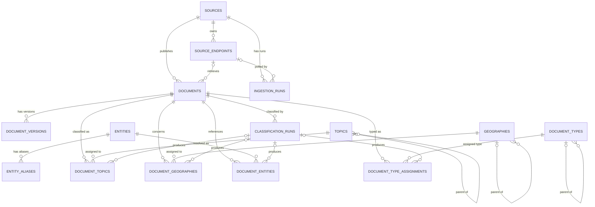

# Global News Intelligence Platform — Current Database Schema

**Document type:** Living implementation reference  
**Snapshot date:** 2026-07-28
**Platform phase:** Intelligence Calendar Phase 2 frozen
**Alembic revision:** `b8d4f0a2c315`
**PostgreSQL server version:** 17.10  
**Schema:** `public`  
**Authoritative snapshot:** `CURRENT_SCHEMA.sql`

---

## 1. Purpose

This document describes the database schema that is **actually implemented in PostgreSQL** at the snapshot identified above.

It is intentionally different from `DATABASE_SCHEMA_SPECIFICATION.md`:

- `DATABASE_SCHEMA.md` documents **what exists now**.
- `DATABASE_SCHEMA_SPECIFICATION.md` documents **the intended/future architecture**.
- `CURRENT_SCHEMA.sql` is the machine-readable PostgreSQL schema-only snapshot.
- Alembic migrations remain the authoritative incremental migration history.
- `SCHEMA_CHANGELOG.md` records major architectural schema milestones.

Future database design work should consult this document before adding or changing tables.

---

## 2. Current Schema Summary

The current schema contains **99 tables**:

1 Alembic infrastructure table
15 pre-GFA application/classification tables
5 GFA-A reference-catalog tables
2 GFA-B language-foundation tables
13 GFA-C semantic-entity foundation tables
1 GFA-D content-format catalog table
10 GFA-E coverage-profile tables
13 Step 25 Monitor Rule Engine tables
5 Step 26 alert-delivery tables
22 Calendar Phase 1 tables
12 Calendar Phase 2 inference-persistence tables

| Table | Purpose |
|---|---|
| `alembic_version` | Records the current Alembic migration revision. |
| `sources` | Canonical publisher/source organizations. |
| `source_endpoints` | Pollable acquisition endpoints belonging to sources. |
| `documents` | Current normalized representation of ingested items. |
| `document_versions` | Immutable historical content snapshots for documents. |
| `ingestion_runs` | Durable operational history for ingestion attempts. |
| `topics` | Canonical hierarchical topic taxonomy. |
| `geographies` | Canonical hierarchical geography vocabulary. |
| `entities` | Canonical resolved entities. |
| `entity_aliases` | Multilingual and alternate names for canonical entities. |
| `document_types` | Canonical semantic document-type taxonomy. |
| `classification_runs` | Auditable execution records for document-classification passes. |
| `document_topics` | Historical/current document-to-topic classification assertions. |
| `document_geographies` | Historical/current document-to-geography classification assertions. |
| `document_entities` | Historical/current document-to-entity classification assertions. |
| `document_type_assignments` | Historical/current semantic document-type assignments. |
| `source_types` | Canonical source-organization type catalog. |
| `endpoint_types` | Canonical acquisition endpoint-type catalog. |
| `endpoint_formats` | Canonical endpoint-format catalog. |
| `content_formats` | Canonical document medium/container catalog. |
| `acquisition_methods` | Canonical retrieval/acquisition-method catalog. |
| `platforms` | Canonical external platform catalog. |
| `language_tags` | Canonical BCP 47 language-tag registry used by persisted language fields. |
| `language_tag_aliases` | Accepted aliases mapping external/legacy language values to canonical tags. |
| `semantic_assignment_methods` | Canonical semantic-assertion derivation methods. |
| `entity_types` | Canonical GNI entity-type registry. |
| `entity_type_hierarchy_edges` | Directed acyclic entity-type hierarchy edges. |
| `entity_type_assignments` | Historical/current entity-to-type assertions. |
| `external_semantic_authorities` | Organizations responsible for external semantic schemes. |
| `external_semantic_schemes` | External ontologies, vocabularies, and namespaces. |
| `external_semantic_resource_kinds` | Canonical external semantic resource kinds. |
| `external_semantic_resources` | Reusable external concepts, classes, properties, and individuals. |
| `semantic_mapping_relations` | Typed SKOS, OWL, and RDFS mapping relations. |
| `entity_type_external_mappings` | Strongly typed entity-type mappings to external resources. |
| `entity_geography_relationship_types` | Canonical entity-geography semantic properties. |
| `entity_geographies` | Historical/current typed entity-geography assertions. |
| `entity_geography_relationship_type_external_mappings` | Strongly typed external property mappings for entity-geography relationship types. |
| `coverage_profiles` | Named operator monitoring scopes and default polling policy. |
| `coverage_profile_geographies` | Geography selectors with explicit descendant policy. |
| `coverage_profile_topics` | Topic selectors with explicit descendant policy. |
| `coverage_profile_source_types` | Source-type selectors with explicit descendant policy. |
| `coverage_profile_sources` | Explicit source selectors. |
| `coverage_profile_languages` | Enabled original/content language selectors. |
| `coverage_profile_translation_targets` | Ordered translation-output languages. |
| `coverage_profile_document_types` | Semantic document-type selectors with descendant policy. |
| `coverage_profile_content_formats` | Content-format selectors. |
| `coverage_profile_source_polling_overrides` | Per-profile source polling-priority overrides. |
| `monitors` | Profile-owned Monitor identity, lifecycle, activation, and expiration policy. |
| `monitor_revisions` | Immutable scalar criteria for each versioned Monitor definition. |
| `monitor_revision_geographies` | Geography selectors with explicit descendant policy. |
| `monitor_revision_topics` | Topic selectors with explicit descendant policy. |
| `monitor_revision_entities` | Canonical entity selectors. |
| `monitor_revision_entity_roles` | Entity-role selectors. |
| `monitor_revision_document_types` | Semantic document-type selectors with descendant policy. |
| `monitor_revision_content_formats` | Content-format selectors. |
| `monitor_revision_sources` | Explicit source selectors. |
| `monitor_revision_source_types` | Source-type selectors with descendant policy. |
| `monitor_revision_languages` | Effective-language selectors. |
| `monitor_evaluation_runs` | Auditable Monitor evaluation attempts and outcomes. |
| `monitor_matches` | Idempotent Monitor-to-document match history. |

Current Alembic revision:

```text
c25f4a7b9d02
```

No custom PostgreSQL enum types or extensions are present. Six PostgreSQL
functions, five deferred constraint triggers, and ten immediate history
triggers enforce the acyclic entity-type hierarchy, the
exactly-one-active-default coverage-profile invariant, and sealed immutable
Monitor revisions.

Step 22 is an additive schema expansion. No Phase 1 table was repurposed or renamed.

---

## 3. Entity Relationship Overview



### Deletion behavior

```text
sources
  └─ source_endpoints                 ON DELETE CASCADE

sources
  └─ documents                        ON DELETE RESTRICT

sources
  └─ ingestion_runs                   ON DELETE RESTRICT

source_endpoints
  └─ documents                        ON DELETE SET NULL

source_endpoints
  └─ ingestion_runs                   ON DELETE SET NULL

documents
  ├─ document_versions                ON DELETE CASCADE
  ├─ classification_runs              ON DELETE CASCADE
  ├─ document_topics                  ON DELETE CASCADE
  ├─ document_geographies             ON DELETE CASCADE
  ├─ document_entities                ON DELETE CASCADE
  └─ document_type_assignments        ON DELETE CASCADE

classification_runs
  ├─ document_topics                  ON DELETE SET NULL
  ├─ document_geographies             ON DELETE SET NULL
  ├─ document_entities                ON DELETE SET NULL
  └─ document_type_assignments        ON DELETE SET NULL

topics
  ├─ topics.parent_id                 ON DELETE RESTRICT
  └─ document_topics                  ON DELETE RESTRICT

geographies
  ├─ geographies.parent_id            ON DELETE RESTRICT
  └─ document_geographies             ON DELETE RESTRICT

entities
  ├─ entity_aliases                   ON DELETE CASCADE
  └─ document_entities                ON DELETE RESTRICT

document_types
  ├─ document_types.parent_id         ON DELETE RESTRICT
  └─ document_type_assignments        ON DELETE RESTRICT
```

The classification model deliberately prevents deletion of canonical vocabulary that is still referenced by classification history.

A classification assertion may survive deletion of its `classification_run` because that foreign key uses `ON DELETE SET NULL`. Its own method, classifier version, confidence, evidence, timestamps, and override provenance remain available.

---

# 4. `alembic_version`

## Purpose

Stores the Alembic migration revision currently applied to the database.

## Columns

| Column | PostgreSQL type | Null | Default | Notes |
|---|---|---:|---|---|
| `version_num` | `varchar(32)` | No | — | Current Alembic revision identifier. |

## Constraints

- Primary key: `version_num`

Current value at this snapshot:

```text
f8a1c2d3e4b5
```

---

# 5. `sources`

## Purpose

Represents canonical organizations, publishers, agencies, institutions, or other information sources.

A Source is distinct from a Source Endpoint. One source may own multiple endpoints.

## Columns

| Column | PostgreSQL type | Null | Default | Semantics |
|---|---|---:|---|---|
| `id` | `bigint` | No | sequence | Primary key. |
| `name` | `varchar(255)` | No | — | Canonical display name. |
| `native_name` | `varchar(255)` | Yes | — | Native-language source name when available. |
| `country` | `varchar(100)` | No | — | Home country/jurisdiction of the source organization. |
| `primary_language` | `varchar(255)` | No | — | Primary source language. |
| `source_type` | `varchar(50)` | No | — | Source organization/type classification used by the application. |
| `status` | `varchar(30)` | No | `'active'` | Lifecycle status. |
| `website_url` | `text` | Yes | — | Canonical website URL where available. |
| `metadata` | `jsonb` | No | `{}` | Extensible source metadata. |
| `created_at` | `timestamptz` | No | `now()` | Creation timestamp. |
| `updated_at` | `timestamptz` | No | `now()` | Last application-managed update timestamp. |
| `primary_language` | `varchar(255)` | No | — | Canonical BCP 47 primary language tag for the source. |
| `source_type` | `varchar(50)` | No | — | Canonical source type referencing `source_types.slug`. |

## Language invariant

`sources.primary_language` describes the source's default language; it
does not determine document language.

## Important semantic invariant

`sources.country` identifies the source organization's home country or jurisdiction.

It **must not** be treated as the authoritative geography of every document published by that source.

Canonical document geography now belongs in `geographies` plus `document_geographies`.

source organization and must not be copied blindly into `documents.language`.

`documents.language` stores the language observed in the individual document.

It must not be inferred from `sources.primary_language`; a source can publish documents in languages other than its primary language.

## Constraints

- Primary key: `id`
- Unique: `website_url`

## Indexes

```text
ix_sources_country
ix_sources_country_status
ix_sources_source_type
ix_sources_status
ix_sources_type_status
```

## Relationships

- One source may own many `source_endpoints`.
- One source may own many `documents`.
- One source may own many `ingestion_runs`.

Deletion behavior:

- deleting a source cascades to its endpoints;
- deletion is restricted while documents or ingestion runs reference the source.

---

# 6. `source_endpoints`

## Purpose

Represents individual pollable acquisition endpoints belonging to a Source.

## Columns

| Column | PostgreSQL type | Null | Default | Semantics |
|---|---|---:|---|---|
| `id` | `bigint` | No | sequence | Primary key. |
| `source_id` | `bigint` | No | — | Parent Source. |
| `name` | `varchar(255)` | Yes | — | Endpoint-specific name. |
| `endpoint_type` | `varchar(50)` | No | — | Canonical endpoint category, such as `feed`. |
| `endpoint_format` | `varchar(50)` | No | — | Canonical serialization/content format, such as `rss` or `atom`. |
| `acquisition_method` | `varchar(50)` | No | — | Retrieval mechanism, such as `feed_parser`. |
| `platform` | `varchar(50)` | Yes | — | Optional canonical external platform. |
| `url` | `text` | No | — | Pollable endpoint URL. |
| `status` | `varchar(30)` | No | `'active'` | Endpoint lifecycle status. |
| `poll_interval_seconds` | `integer` | No | `900` | Normal polling interval. |
| `last_checked_at` | `timestamptz` | Yes | — | Last verification/poll check. |
| `last_success_at` | `timestamptz` | Yes | — | Last successful endpoint operation. |
| `next_poll_at` | `timestamptz` | Yes | — | Scheduler's next eligible poll time. |
| `etag` | `varchar(512)` | Yes | — | HTTP ETag validator. |
| `last_modified` | `varchar(255)` | Yes | — | HTTP Last-Modified validator. |
| `last_http_status` | `integer` | Yes | — | Most recent HTTP response status. |
| `consecutive_failures` | `integer` | No | `0` | Consecutive failure counter. |
| `last_error` | `text` | Yes | — | Most recent endpoint error message. |
| `metadata` | `jsonb` | No | `{}` | Extensible endpoint metadata. |
| `created_at` | `timestamptz` | No | `now()` | Creation timestamp. |
| `updated_at` | `timestamptz` | No | `now()` | Last application-managed update timestamp. |

## Constraints

- Primary key: `id`
- Foreign key: `source_id → sources.id ON DELETE CASCADE`
- Unique: `url`
- Check: `poll_interval_seconds >= 60`

## Indexes

```text
ix_source_endpoints_due_poll
ix_source_endpoints_endpoint_type
ix_source_endpoints_source_id
ix_source_endpoints_source_status
ix_source_endpoints_status
```

---

# 7. `documents`

## Purpose

Stores the current normalized representation of an ingested content item.

## Columns

| Column | PostgreSQL type | Null | Default | Semantics |
|---|---|---:|---|---|
| `id` | `bigint` | No | sequence | Primary key. |
| `source_id` | `bigint` | No | — | Canonical publishing Source. |
| `source_endpoint_id` | `bigint` | Yes | — | Endpoint that acquired the item. |
| `ingestion_format` | `varchar(50)` | No | — | Canonical acquisition envelope referencing `endpoint_formats.slug`. |
| `content_format` | `varchar(50)` | No | — | Canonical medium/container referencing `content_formats.slug`. |
| `external_id` | `varchar(2048)` | Yes | — | Source-provided item identifier. |
| `canonical_url` | `text` | Yes | — | Canonical publisher URL. |
| `title_original` | `text` | No | — | Original-language title. |
| `summary_original` | `text` | Yes | — | Original source summary/description. |
| `content_original` | `text` | Yes | — | Original source content when supplied/extracted. |
| `language` | `varchar(255)` | Yes | — | Document language when known. |
| `country` | `varchar(100)` | Yes | — | Legacy Phase 1 document country field. |
| `author` | `varchar(512)` | Yes | — | Source-provided author/byline. |
| `published_at` | `timestamptz` | Yes | — | Original publication timestamp. |
| `source_updated_at` | `timestamptz` | Yes | — | Source-provided update timestamp. |
| `retrieved_at` | `timestamptz` | No | `now()` | Retrieval timestamp. |
| `content_hash` | `varchar(64)` | No | — | SHA-256 content hash. |
| `metadata` | `jsonb` | No | `{}` | Extensible document metadata. |
| `created_at` | `timestamptz` | No | `now()` | Database creation timestamp. |
| `updated_at` | `timestamptz` | No | `now()` | Last application-managed update timestamp. |

## Critical Phase 2 semantic warning

`documents.country` remains a Phase 1 field and **is not canonical document geography**.

Canonical geography is now:

```text
geographies
document_geographies
```

Semantic document type remains:

```text
document_types
document_type_assignments
```

It is independent from both `ingestion_format` and `content_format`.

## Constraints

- Primary key: `id`
- Foreign key: `source_id → sources.id ON DELETE RESTRICT`
- Foreign key: `source_endpoint_id → source_endpoints.id ON DELETE SET NULL`
- Foreign key: `ingestion_format → endpoint_formats.slug ON DELETE RESTRICT`
- Foreign key: `content_format → content_formats.slug ON DELETE RESTRICT`
- Unique: `(source_endpoint_id, external_id)`

## Indexes

```text
ix_documents_content_hash
ix_documents_content_format_published_at
ix_documents_country
ix_documents_endpoint_published_at
ix_documents_language
ix_documents_ingestion_format_published_at
ix_documents_published_at
ix_documents_retrieved_at
ix_documents_source_endpoint_id
ix_documents_source_id
ix_documents_source_published_at
```

---

# 8. `document_versions`

## Purpose

Stores historical snapshots when an existing document changes.

## Columns

| Column | PostgreSQL type | Null | Default | Semantics |
|---|---|---:|---|---|
| `id` | `bigint` | No | sequence | Primary key. |
| `document_id` | `bigint` | No | — | Parent document. |
| `version_number` | `integer` | No | — | Version sequence beginning at 1. |
| `canonical_url` | `text` | Yes | — | Canonical URL snapshot. |
| `title_original` | `text` | No | — | Title snapshot. |
| `summary_original` | `text` | Yes | — | Summary snapshot. |
| `content_original` | `text` | Yes | — | Content snapshot. |
| `content_format` | `varchar(50)` | No | — | Canonical medium/container snapshot. |
| `language` | `varchar(255)` | Yes | — | Language snapshot. |
| `country` | `varchar(100)` | Yes | — | Legacy Phase 1 country snapshot. |
| `author` | `varchar(512)` | Yes | — | Author snapshot. |
| `published_at` | `timestamptz` | Yes | — | Publication timestamp snapshot. |
| `source_updated_at` | `timestamptz` | Yes | — | Source update timestamp snapshot. |
| `retrieved_at` | `timestamptz` | No | — | Retrieval timestamp represented by the version. |
| `content_hash` | `varchar(64)` | No | — | Content hash for this version. |
| `changed_fields` | `jsonb` | No | `[]` | Fields identified as changed. |
| `metadata` | `jsonb` | No | `{}` | Version metadata snapshot. |
| `created_at` | `timestamptz` | No | `now()` | Version record creation time. |

## Constraints

- Primary key: `id`
- Foreign key: `document_id → documents.id ON DELETE CASCADE`
- Foreign key: `content_format → content_formats.slug ON DELETE RESTRICT`
- Unique: `(document_id, content_hash, content_format)`
- Unique: `(document_id, version_number)`
- Check: `version_number >= 1`

## Indexes

```text
ix_document_versions_content_hash
ix_document_versions_content_format
ix_document_versions_document_created_at
ix_document_versions_document_id
```

`document_versions` intentionally lacks `updated_at` because versions are historical snapshots.

---

# 9. `ingestion_runs`

## Purpose

Provides durable operational history for ingestion attempts and remains authoritative instead of a Celery result backend.

## Columns

| Column | PostgreSQL type | Null | Default | Semantics |
|---|---|---:|---|---|
| `id` | `bigint` | No | sequence | Primary key. |
| `source_id` | `bigint` | No | — | Source associated with run. |
| `source_endpoint_id` | `bigint` | Yes | — | Endpoint associated with run. |
| `endpoint_url` | `text` | No | — | URL snapshot. |
| `trigger_type` | `varchar(30)` | No | `'scheduled'` | Run trigger. |
| `status` | `varchar(30)` | No | `'running'` | Run lifecycle status. |
| `started_at` | `timestamptz` | No | `now()` | Start time. |
| `finished_at` | `timestamptz` | Yes | — | Finish time. |
| `duration_ms` | `bigint` | Yes | — | Duration in milliseconds. |
| `http_status` | `integer` | Yes | — | HTTP status when applicable. |
| `response_bytes` | `bigint` | Yes | — | Response size when known. |
| `items_seen` | `integer` | No | `0` | Items encountered. |
| `items_created` | `integer` | No | `0` | New documents created. |
| `items_updated` | `integer` | No | `0` | Existing documents updated/versioned. |
| `items_unchanged` | `integer` | No | `0` | Unchanged items. |
| `items_failed` | `integer` | No | `0` | Item-level failures. |
| `error_type` | `varchar(255)` | Yes | — | Error category. |
| `error_message` | `text` | Yes | — | Human-readable error. |
| `error_details` | `jsonb` | No | `{}` | Structured error data. |
| `metadata` | `jsonb` | No | `{}` | Extensible run metadata. |
| `created_at` | `timestamptz` | No | `now()` | Row creation timestamp. |
| `updated_at` | `timestamptz` | No | `now()` | Last application-managed update timestamp. |

## Constraints

- Primary key: `id`
- Foreign key: `source_id → sources.id ON DELETE RESTRICT`
- Foreign key: `source_endpoint_id → source_endpoints.id ON DELETE SET NULL`
- `duration_ms IS NULL OR duration_ms >= 0`
- `finished_at IS NULL OR finished_at >= started_at`
- `http_status IS NULL OR http_status BETWEEN 100 AND 599`
- all item counters are nonnegative
- `response_bytes IS NULL OR response_bytes >= 0`

## Indexes

```text
ix_ingestion_runs_endpoint_started_at
ix_ingestion_runs_source_started_at
ix_ingestion_runs_status_started_at
```

---

# 10. `topics`

## Purpose

Stores the canonical hierarchical topic taxonomy.

The table supports arbitrary hierarchy depth through a self-referencing `parent_id`.

## Columns

| Column | PostgreSQL type | Null | Default | Semantics |
|---|---|---:|---|---|
| `id` | `bigint` | No | sequence | Internal primary key. |
| `parent_id` | `bigint` | Yes | — | Parent topic; `NULL` for roots. |
| `slug` | `varchar(255)` | No | — | Stable canonical machine identifier. |
| `name` | `varchar(255)` | No | — | Canonical display name. |
| `native_name` | `varchar(255)` | Yes | — | Optional native-language name. |
| `description` | `text` | Yes | — | Definition/description. |
| `depth` | `integer` | No | `0` | Hierarchy depth. |
| `sort_order` | `integer` | No | `0` | Stable ordering value. |
| `taxonomy_version` | `varchar(50)` | No | — | Taxonomy version. |
| `is_active` | `boolean` | No | `true` | Active/retired state. |
| `created_at` | `timestamptz` | No | `now()` | Creation timestamp. |
| `updated_at` | `timestamptz` | No | `now()` | Last application-managed update timestamp. |

## Constraints

- Primary key: `id`
- Foreign key: `parent_id → topics.id ON DELETE RESTRICT`
- Unique: `slug`
- Check: `depth >= 0`
- Check: `sort_order >= 0`

## Indexes

```text
ix_topics_active_sort_order
ix_topics_parent_sort_order
```

## Seed state

Migration `d7b4f2a19c6e` seeded the frozen **Canonical Topic Taxonomy v1.0** root layer:

```text
Politics
Law & Judiciary
War & Security
Foreign Affairs
Economy
Business
Technology
Energy
Health
Science
Environment
Society
Crime
Immigration
Media
Education
Religion
Arts, Culture & Entertainment
Disasters & Emergencies
Labor & Employment
Sports
Weather
Lifestyle & Human Interest
```

Stable slugs, not generated numeric IDs, are canonical identifiers.

---

# 11. `geographies`

## Purpose

Stores canonical spatial and jurisdictional concepts for document classification.

Geography is separate from source country and from named location entities.

## Columns

| Column | PostgreSQL type | Null | Default | Semantics |
|---|---|---:|---|---|
| `id` | `bigint` | No | sequence | Primary key. |
| `parent_id` | `bigint` | Yes | — | Optional parent geography. |
| `slug` | `varchar(255)` | No | — | Stable canonical identifier. |
| `name` | `varchar(255)` | No | — | Display name. |
| `native_name` | `varchar(255)` | Yes | — | Native-language name. |
| `geography_type` | `varchar(50)` | No | — | Geography category. |
| `iso_code` | `varchar(20)` | Yes | — | ISO-style identifier. |
| `country_code` | `varchar(10)` | Yes | — | Country code. |
| `region_code` | `varchar(50)` | Yes | — | Region code. |
| `is_active` | `boolean` | No | `true` | Active/retired state. |
| `metadata` | `jsonb` | No | `{}` | Extensible metadata. |
| `created_at` | `timestamptz` | No | `now()` | Creation timestamp. |
| `updated_at` | `timestamptz` | No | `now()` | Last application-managed update. |

## Constraints

- Primary key: `id`
- Foreign key: `parent_id → geographies.id ON DELETE RESTRICT`
- Unique: `slug`

## Indexes

```text
ix_geographies_country_code
ix_geographies_parent_name
ix_geographies_region_code
ix_geographies_type_active
```

## Seed state

Migration `d7b4f2a19c6e` seeded:

```text
United States
South Korea
Japan
Taiwan
China
North Korea
Philippines
Indo-Pacific
```

The first seven are `country`; `Indo-Pacific` is `custom_region`.

---

# 12. `entities`

## Purpose

Stores canonical resolved entities independent of raw mention text.

## Columns

| Column | PostgreSQL type | Null | Default | Semantics |
|---|---|---:|---|---|
| `id` | `bigint` | No | sequence | Primary key. |
| `canonical_name` | `varchar(512)` | No | — | Canonical identity/display name. |
| `canonical_name_native` | `varchar(512)` | Yes | — | Native-language canonical name. |
| `is_active` | `boolean` | No | `true` | Active/retired state. |
| `metadata` | `jsonb` | No | `{}` | Extensible metadata. |
| `created_at` | `timestamptz` | No | `now()` | Creation timestamp. |
| `updated_at` | `timestamptz` | No | `now()` | Last application-managed update. |

## Constraints

- Primary key: `id`

No unique constraint exists on `canonical_name`; real-world names are not globally unique.

## Indexes

```text
ix_entities_canonical_name
```

---

# 13. `entity_aliases`

## Purpose

Stores multilingual, abbreviated, transliterated, alternate, and historical names for canonical entities.

## Columns

| Column | PostgreSQL type | Null | Default | Semantics |
|---|---|---:|---|---|
| `id` | `bigint` | No | sequence | Primary key. |
| `entity_id` | `bigint` | No | — | Canonical entity. |
| `alias` | `varchar(512)` | No | — | Alias text. |
| `language` | `varchar(255)` | No | `'und'` | Language; `und` means undetermined. |
| `script` | `varchar(50)` | Yes | — | Optional script identifier. |
| `alias_type` | `varchar(50)` | Yes | — | Alias category. |
| `is_preferred` | `boolean` | No | `false` | Preferred alias indicator. |
| `normalized_alias` | `varchar(512)` | No | — | Normalized matching form. |
| `created_at` | `timestamptz` | No | `now()` | Creation timestamp. |
| `updated_at` | `timestamptz` | No | `now()` | Last application-managed update. |

## Constraints

- Primary key: `id`
- Foreign key: `entity_id → entities.id ON DELETE CASCADE`
- Unique: `(entity_id, normalized_alias, language)`

## Indexes

```text
ix_entity_aliases_normalized_language
```

`language` remains NOT NULL but no longer has an automatic `und` default.

---

# 14. `document_types`

## Purpose

Stores canonical semantic document types, separate from source/acquisition type.

## Columns

| Column | PostgreSQL type | Null | Default | Semantics |
|---|---|---:|---|---|
| `id` | `bigint` | No | sequence | Primary key. |
| `parent_id` | `bigint` | Yes | — | Optional parent document type. |
| `slug` | `varchar(255)` | No | — | Stable canonical identifier. |
| `name` | `varchar(255)` | No | — | Display name. |
| `description` | `text` | Yes | — | Definition/description. |
| `is_active` | `boolean` | No | `true` | Active/retired state. |
| `created_at` | `timestamptz` | No | `now()` | Creation timestamp. |
| `updated_at` | `timestamptz` | No | `now()` | Last application-managed update. |

## Constraints

- Primary key: `id`
- Foreign key: `parent_id → document_types.id ON DELETE RESTRICT`
- Unique: `slug`

## Indexes

```text
ix_document_types_active_name
ix_document_types_parent_name
```

## Seed state

Migration `d7b4f2a19c6e` seeded 35 canonical document types:

```text
news_report
breaking_news
analysis
opinion
editorial
investigative_report
government_release
press_release
official_statement
speech
transcript
court_decision
court_filing
legal_notice
legislation
bill
regulation
rulemaking
public_notice
procurement_notice
tender
sanctions_notice
regulatory_filing
corporate_filing
research_paper
think_tank_report
policy_brief
statistical_release
calendar_notice
event_announcement
video
social_post
newsletter
podcast_episode
other
```

---

# 15. `classification_runs`

## Purpose

Provides an auditable execution record for a document-classification pass.

## Columns

| Column | PostgreSQL type | Null | Default | Semantics |
|---|---|---:|---|---|
| `id` | `bigint` | No | sequence | Primary key. |
| `document_id` | `bigint` | No | — | Document classified by this run. |
| `pipeline_version` | `varchar(100)` | No | — | Classification pipeline version. |
| `taxonomy_version` | `varchar(50)` | No | — | Taxonomy version active for the run. |
| `started_at` | `timestamptz` | No | `now()` | Run start. |
| `completed_at` | `timestamptz` | Yes | — | Run completion. |
| `status` | `varchar(30)` | No | `'running'` | Run lifecycle status. |
| `language` | `varchar(255)` | Yes | — | Classification input language. |
| `classifier_versions` | `jsonb` | No | `{}` | Participating classifier versions. |
| `ruleset_version` | `varchar(100)` | Yes | — | Deterministic ruleset version. |
| `llm_provider` | `varchar(100)` | Yes | — | LLM provider when used. |
| `llm_model` | `varchar(255)` | Yes | — | LLM model when used. |
| `input_hash` | `varchar(64)` | Yes | — | Optional input hash. |
| `output_hash` | `varchar(64)` | Yes | — | Optional output hash. |
| `error` | `text` | Yes | — | Error information. |
| `metadata` | `jsonb` | No | `{}` | Extensible run metadata. |
| `created_at` | `timestamptz` | No | `now()` | Row creation timestamp. |
| `updated_at` | `timestamptz` | No | `now()` | Last application-managed update. |

## Constraints

- Primary key: `id`
- Foreign key: `document_id → documents.id ON DELETE CASCADE`
- Check: `completed_at IS NULL OR completed_at >= started_at`

## Indexes

```text
ix_classification_runs_document_started
ix_classification_runs_status_started
```

# 16. Shared Classification Assertion Model

The four relationship tables:

```text
document_topics
document_geographies
document_entities
document_type_assignments
```

share a common provenance and current-state design.

## Shared columns

| Column | PostgreSQL type | Null | Default | Semantics |
|---|---|---:|---|---|
| `id` | `bigint` | No | sequence | Surrogate assertion primary key. |
| `confidence` | `numeric(5,4)` | No | — | Normalized confidence from `0.0000` to `1.0000`. |
| `classification_method` | `varchar(50)` | No | — | Method that created the assertion. |
| `classifier_version` | `varchar(255)` | Yes | — | Rule/classifier/model version. |
| `classification_run_id` | `bigint` | Yes | — | Producing classification run when applicable. |
| `is_manual_override` | `boolean` | No | `false` | Explicit human/operator override. |
| `override_actor_type` | `varchar(50)` | Yes | — | Actor category, currently typically `operator`. |
| `override_actor_key` | `varchar(255)` | Yes | — | Actor identifier, currently typically `local`. |
| `override_reason` | `text` | Yes | — | Override reason. |
| `evidence` | `jsonb` | No | `{}` | Supporting rules, matched terms, model output, or other evidence. |
| `is_active` | `boolean` | No | `true` | Whether this assertion belongs to current classification state. |
| `superseded_at` | `timestamptz` | Yes | — | When a historical assertion was superseded. |
| `created_at` | `timestamptz` | No | `now()` | Creation timestamp. |
| `updated_at` | `timestamptz` | No | `now()` | Last application-managed update. |

## Shared constraints

Every classification assertion table enforces:

```text
0 <= confidence <= 1
```

Manual override rows additionally require:

```text
is_manual_override = true
    ⇒ classification_method = 'manual'
```

and:

```text
is_manual_override = true
    ⇒ override_actor_type IS NOT NULL
    AND override_actor_key IS NOT NULL
```

The current single-operator installation can therefore truthfully record:

```text
override_actor_type = operator
override_actor_key  = local
```

without inventing an authenticated user row that does not yet exist.

## Historical/current-state model

The schema uses surrogate assertion IDs rather than composite relationship primary keys.

That permits historical assertions to coexist:

```text
old automated assertion
new automated assertion
manual override
later reclassification
```

Current state is represented by `is_active = true`.

Superseded assertions may remain with:

```text
is_active = false
superseded_at = <timestamp>
```

The database does not currently require every inactive row to have `superseded_at`; that lifecycle consistency remains an application/service-layer responsibility.

---

# 17. `document_topics`

## Purpose

Stores document-to-topic assertions with role, taxonomy version, confidence, provenance, historical state, and manual-override provenance.

## Classification-specific columns

| Column | PostgreSQL type | Null | Semantics |
|---|---|---:|---|
| `document_id` | `bigint` | No | Classified document. |
| `topic_id` | `bigint` | No | Canonical topic. |
| `relationship_role` | `varchar(50)` | No | Topic relationship role. |
| `taxonomy_version` | `varchar(50)` | No | Taxonomy version used for this assertion. |

The table also includes all shared columns documented in Section 16.

## Foreign keys

- `document_id → documents.id ON DELETE CASCADE`
- `topic_id → topics.id ON DELETE RESTRICT`
- `classification_run_id → classification_runs.id ON DELETE SET NULL`

## Indexes

```text
ix_document_topics_classification_run
ix_document_topics_document_active
ix_document_topics_topic_active
```

## Current-state uniqueness

```text
uq_document_topics_active_relationship
(document_id, topic_id, relationship_role)
WHERE is_active
```

Historical inactive versions of the same relationship may coexist.

---

# 18. `document_geographies`

## Purpose

Stores multi-valued document geography assertions independently of source country and legacy `documents.country`.

## Classification-specific columns

| Column | PostgreSQL type | Null | Semantics |
|---|---|---:|---|
| `document_id` | `bigint` | No | Classified document. |
| `geography_id` | `bigint` | No | Canonical geography. |
| `relationship_role` | `varchar(50)` | No | Spatial/jurisdictional relationship role. |
| `taxonomy_version` | `varchar(50)` | No | Geography taxonomy/version context. |

The table also includes all shared columns documented in Section 16.

## Foreign keys

- `document_id → documents.id ON DELETE CASCADE`
- `geography_id → geographies.id ON DELETE RESTRICT`
- `classification_run_id → classification_runs.id ON DELETE SET NULL`

## Indexes

```text
ix_document_geographies_classification_run
ix_document_geographies_document_active
ix_document_geographies_geography_active
```

## Current-state uniqueness

```text
uq_document_geographies_active_relationship
(document_id, geography_id, relationship_role)
WHERE is_active
```

A document may have multiple active geographies and multiple geography roles.

---

# 19. `document_entities`

## Purpose

Stores resolved document-to-entity assertions while retaining original mention text where useful.

## Classification-specific columns

| Column | PostgreSQL type | Null | Default | Semantics |
|---|---|---:|---|---|
| `document_id` | `bigint` | No | — | Classified document. |
| `entity_id` | `bigint` | No | — | Canonical entity. |
| `mention_text` | `text` | Yes | — | Raw mention text supporting the resolution. |
| `entity_role` | `varchar(50)` | No | `'mentioned'` | Role played by the entity. |

The table also includes all shared columns documented in Section 16.

## Foreign keys

- `document_id → documents.id ON DELETE CASCADE`
- `entity_id → entities.id ON DELETE RESTRICT`
- `classification_run_id → classification_runs.id ON DELETE SET NULL`

## Indexes

```text
ix_document_entities_classification_run
ix_document_entities_document_active
ix_document_entities_entity_active
```

## Current-state uniqueness

```text
uq_document_entities_active_relationship
(document_id, entity_id, entity_role)
WHERE is_active
```

Different active roles for the same entity/document pair are permitted.

---

# 20. `document_type_assignments`

## Purpose

Stores semantic document-type assignments independently of source/acquisition type.

The schema supports one active primary type plus future secondary types.

## Classification-specific columns

| Column | PostgreSQL type | Null | Default | Semantics |
|---|---|---:|---|---|
| `document_id` | `bigint` | No | — | Classified document. |
| `document_type_id` | `bigint` | No | — | Canonical semantic document type. |
| `is_primary` | `boolean` | No | `false` | Marks the primary active type. |

The table also includes all shared columns documented in Section 16.

## Foreign keys

- `document_id → documents.id ON DELETE CASCADE`
- `document_type_id → document_types.id ON DELETE RESTRICT`
- `classification_run_id → classification_runs.id ON DELETE SET NULL`

## Indexes

```text
ix_document_type_assignments_classification_run
ix_document_type_assignments_document_active
ix_document_type_assignments_document_type_active
```

## Current-state uniqueness

A document cannot have duplicate active assignments of the same type:

```text
uq_document_type_assignments_active_type
(document_id, document_type_id)
WHERE is_active
```

A document can have **only one active primary document type**:

```text
uq_document_type_assignments_active_primary
(document_id)
WHERE is_active AND is_primary
```

Historical inactive primary assignments may remain stored.

---

# 21. Current Sequence Objects

The schema contains one PostgreSQL sequence for each bigint application-table primary key:

```text
classification_runs_id_seq
content_formats_id_seq
document_entities_id_seq
document_geographies_id_seq
document_topics_id_seq
document_type_assignments_id_seq
document_types_id_seq
document_versions_id_seq
documents_id_seq
entities_id_seq
entity_aliases_id_seq
entity_geographies_id_seq
entity_geography_relationship_type_external_mappings_id_seq
entity_type_assignments_id_seq
entity_type_external_mappings_id_seq
entity_type_hierarchy_edges_id_seq
entity_types_id_seq
external_semantic_resources_id_seq
external_semantic_schemes_id_seq
geographies_id_seq
ingestion_runs_id_seq
acquisition_methods_id_seq
endpoint_formats_id_seq
endpoint_types_id_seq
platforms_id_seq
source_endpoints_id_seq
source_types_id_seq
sources_id_seq
topics_id_seq
```

Each sequence is owned by the corresponding `id` column.

`alembic_version` does not use a sequence.

---

# 22. Current Index Inventory

## Phase 1 tables

### Sources

```text
ix_sources_country
ix_sources_country_status
ix_sources_source_type
ix_sources_status
ix_sources_type_status
```

### Source Endpoints

```text
ix_source_endpoints_due_poll
ix_source_endpoints_endpoint_type
ix_source_endpoints_source_id
ix_source_endpoints_source_status
ix_source_endpoints_status
```

### Documents

```text
ix_documents_content_hash
ix_documents_content_format_published_at
ix_documents_country
ix_documents_endpoint_published_at
ix_documents_language
ix_documents_ingestion_format_published_at
ix_documents_published_at
ix_documents_retrieved_at
ix_documents_source_endpoint_id
ix_documents_source_id
ix_documents_source_published_at
```

### Document Versions

```text
ix_document_versions_content_hash
ix_document_versions_content_format
ix_document_versions_document_created_at
ix_document_versions_document_id
```

### Ingestion Runs

```text
ix_ingestion_runs_endpoint_started_at
ix_ingestion_runs_source_started_at
ix_ingestion_runs_status_started_at
```

## Step 22 tables

### Topics

```text
ix_topics_active_sort_order
ix_topics_parent_sort_order
```

### Geographies

```text
ix_geographies_country_code
ix_geographies_parent_name
ix_geographies_region_code
ix_geographies_type_active
```

### Entities

```text
ix_entities_canonical_name
```

### Entity Aliases

```text
ix_entity_aliases_normalized_language
```

### Document Types

```text
ix_document_types_active_name
ix_document_types_parent_name
```

### Classification Runs

```text
ix_classification_runs_document_started
ix_classification_runs_status_started
```

### Document Topics

```text
ix_document_topics_classification_run
ix_document_topics_document_active
ix_document_topics_topic_active
uq_document_topics_active_relationship
```

### Document Geographies

```text
ix_document_geographies_classification_run
ix_document_geographies_document_active
ix_document_geographies_geography_active
uq_document_geographies_active_relationship
```

### Document Entities

```text
ix_document_entities_classification_run
ix_document_entities_document_active
ix_document_entities_entity_active
uq_document_entities_active_relationship
```

### Document Type Assignments

```text
ix_document_type_assignments_classification_run
ix_document_type_assignments_document_active
ix_document_type_assignments_document_type_active
uq_document_type_assignments_active_primary
uq_document_type_assignments_active_type
```

---

# 23. Architectural Invariants Reflected in the Current Schema

## Sources and endpoints are separate

```text
Source
  └── one or more Source Endpoints
```

## PostgreSQL is authoritative

Documents, source configuration, endpoint state, version history, ingestion-run history, canonical classification vocabulary, classification execution history, and classification assertions are durable PostgreSQL records.

## Document originals are preserved

```text
title_original
summary_original
content_original
```

AI output does not replace original source material.

## Classification is multi-dimensional

Topic, geography, entity, and document type are independent dimensions.

A document may have:

```text
multiple topics
multiple geographies
multiple entities/roles
one active primary document type
optional active secondary document types
```

## Source geography is not document geography

```text
sources.country
```

describes the publisher/source organization.

```text
documents.country
```

remains a legacy Phase 1 field.

Canonical content geography is:

```text
geographies
+
document_geographies
```

## Source/acquisition type is not document type

```text
sources.source_type
source_endpoints.endpoint_type
```

do not define semantic document type.

Semantic document type is:

```text
document_types
+
document_type_assignments
```

Acquisition and representation are separately:

```text
documents.ingestion_format
documents.content_format
```

## Topic hierarchy is not limited to two levels

`topics.parent_id` permits arbitrary depth.

The UI may use "topic/subtopic" terminology, but the database supports deeper trees.

## Canonical slugs are stable identifiers

Generated bigint IDs are internal database identifiers.

Stable slugs are canonical machine-facing identifiers for topics, geographies, and document types.

## Classification is auditable

Assertions retain:

```text
classification method
classifier version
classification run
confidence
taxonomy version where applicable
evidence
manual-override flag
override actor
override reason
timestamps
```

## Classification is reprocessable

Historical assertions can be deactivated/superseded while newer assertions become current.

Original source content does not need to be rewritten when taxonomy, rules, aliases, or classifiers change.

## Manual overrides do not require a fake user system

The current single-operator installation uses actor provenance fields rather than a fabricated user foreign key.

Current convention:

```text
override_actor_type = operator
override_actor_key  = local
```

A future authentication/audit subsystem should preserve the historical meaning of these records.

## Canonical vocabulary is protected from destructive deletion

Topics, geographies, entities, and document types referenced by classification assertions use `ON DELETE RESTRICT`.

Retirement through `is_active = false` is preferred to destructive deletion for canonical vocabulary.

## JSONB is supporting metadata, not a substitute for canonical relationships

High-value Step 22 relationships are normalized relationally.

JSONB remains appropriate for flexible evidence, classifier-version maps, and supporting metadata.

---

# 24. Canonical Topic Taxonomy State

The implemented root topic taxonomy is **Canonical Topic Taxonomy v1.0**.

The root layer contains exactly 23 approved roots.

The authoritative vocabulary/governance document is:

```text
docs/specifications/CANONICAL_TOPIC_TAXONOMY.md
```

Rules:

- the 23-root layer is frozen for taxonomy v1.0;
- stable slugs are canonical identifiers;
- adding/removing/merging/splitting or materially repurposing a root requires a major taxonomy-version change;
- child and descendant topics may expand under versioned governance;
- document classification may be multi-label.

High-priority child taxonomy remains future work after the Step 22 foundation and should not be silently mixed into v1.0 root seeding.

---

# 25. Classification Provenance and Actor Model

Step 22 establishes the first database-level foundation for the future platform-wide audit/provenance architecture.

Classification assertions currently record:

```text
classification_method
classifier_version
classification_run_id
confidence
evidence
is_manual_override
override_actor_type
override_actor_key
override_reason
created_at
updated_at
is_active
superseded_at
```

This answers two separate questions:

```text
Classification provenance:
What process produced this classification?

Human/operator provenance:
Who or what overrode it?
```

The actor fields are intentionally generic because authenticated users do not yet exist.

A separate authentication/authorization specification and broader audit/provenance specification are planned after Step 22 so this model can evolve without losing historical truth.

---

# 26. Schema Maintenance Procedure

After every schema-changing migration:

```text
Design change
    ↓
Consult DATABASE_SCHEMA.md
    ↓
Update SQLAlchemy models
    ↓
Create/review Alembic migration
    ↓
Run migration tests
    ↓
Apply migration
    ↓
Confirm `alembic current`
    ↓
Regenerate CURRENT_SCHEMA.sql
    ↓
Update DATABASE_SCHEMA.md
    ↓
Update SCHEMA_CHANGELOG.md
    ↓
Commit together
```

Recommended snapshot command:

```bash
pg_dump   --host=localhost   --username=news_intelligence_app   --dbname=news_intelligence   --schema-only   --no-owner   --no-privileges   --format=plain   > docs/database/CURRENT_SCHEMA.sql
```

The schema snapshot must never contain database passwords, application secrets, API keys, or production document data.

A schema-only dump records structure but not seeded rows. Seed vocabulary must therefore also be verified from the applied Alembic migration and/or database queries.

---

# 27. Source of Truth Hierarchy

When documentation disagrees, use this order:

```text
1. Applied PostgreSQL schema
2. Applied Alembic migrations
3. SQLAlchemy implementation
4. DATABASE_SCHEMA.md
5. Future-oriented technical specifications
```

A discrepancy between levels 1–3 is an implementation defect that should be investigated.

A discrepancy between the implemented schema and a future specification may simply indicate that the planned feature has not been implemented yet.

---

# 28. Snapshot Verification

This document was updated from the frozen GFA-E
schema-only PostgreSQL dump generated on 2026-07-26.

Observed/verified characteristics:

```text
PostgreSQL server:    17.10
pg_dump version:      17.10
Alembic revision:     f8a1c2d3e4b5
Schema:               public
Total tables:         47
Application tables:   46
Infrastructure tables: 1
```

Step 22 added ten tables:

```text
topics
geographies
entities
entity_aliases
document_types
classification_runs
document_topics
document_geographies
document_entities
document_type_assignments
```

The Phase 1 five-table application baseline remains present and unchanged in purpose:

```text
sources
source_endpoints
documents
document_versions
ingestion_runs
```

The implemented Step 22 schema now provides the persistence foundation for deterministic classification, classification-aware filtering, monitor rules, and later AI-assisted enrichment.

## GFA-B: Language Tag Canonicalization

GFA-B defines the canonical representation and interpretation of language tags used by the platform.

### `language_tags`

`language_tags` stores the canonical set of supported language tags.

Language tags MUST use **BCP 47 / RFC 5646** syntax and canonical presentation. Each stored tag represents the normalized form used internally by the system.

Examples:

```text
en
en-US
zh-Hans
zh-Hant-TW
sr-Cyrl
sr-Latn
und
zxx
```

External language-tag input MUST be treated as **case-insensitive**. Input such as `EN-us`, `en-US`, and `En-uS` refers to the same language tag.

The database MUST store and return the canonical presentation of the tag rather than preserving arbitrary input casing.

Language, script, and region subtags remain semantically distinct. Normalization MUST NOT collapse these distinctions.

For example:

```text
zh
zh-Hans
zh-Hant
zh-CN
zh-TW
```

represent different levels or types of language identification and MUST NOT be treated as interchangeable merely because they share the same primary language subtag.

### `language_tag_aliases`

`language_tag_aliases` maps accepted alternative, deprecated, legacy, or otherwise non-canonical language-tag representations to their canonical `language_tags` entry.

Aliases exist to normalize external input without allowing multiple internal representations of the same canonical language tag.

External matching against aliases MUST be case-insensitive.

The canonical tag referenced by an alias remains the authoritative stored representation.

### Missing and Special Language Values

Language values have distinct meanings:

```text
NULL
```

means that the language is **missing or unknown**. No positive language determination has been made.

```text
und
```

means **undetermined**. The system positively determined that a language value applies but could not identify which language it is.

```text
zxx
```

means **nonlinguistic or not applicable**. The content does not contain linguistic material for which a document language can meaningfully be assigned.

These values MUST NOT be treated as equivalent.

In particular:

```text
NULL != und
NULL != zxx
und  != zxx
```

### Document Language Semantics

The document language represents the language of the document content itself.

The language of the source, publisher, website, feed, account, domain, or ingestion channel MUST NOT determine the document language.

For example, an English-language website may publish a Korean-language document. The source may be associated with English, while the document language remains Korean.

Source-language metadata may be retained independently, but it MUST NOT override or infer the canonical document language solely from the source.

### GFA-B Rules

GFA-B requires the following invariants:

```text
1. Language tags conform to BCP 47 / RFC 5646.
2. External language-tag input is matched case-insensitively.
3. Stored language tags use canonical presentation.
4. NULL means missing or unknown.
5. und means positively undetermined.
6. zxx means nonlinguistic or not applicable.
7. Language, script, and region remain distinct.
8. Source language does not determine document language.
9. Aliases resolve to one canonical language_tags entry.
10. Canonical document-language values are stored independently of source-language metadata.
```

# 29. GFA-C Semantic Entity Foundation Candidate

Alembic revision `a84c1d9e7f32` adds the implementation candidate for
GFA-C.4.1 through GFA-C.4.3.

This section documents the schema verified by applying the full Alembic
history to an isolated PostgreSQL 17.10 database and running the
repository test suite and GFA-C verification SQL.

## Canonical entity types

```text
entity_types
entity_type_hierarchy_edges
entity_type_assignments
semantic_assignment_methods
```

Entity types use stable slugs. Hierarchy edges form a database-enforced
directed acyclic graph. Type assignments are multi-valued and
historical, with a partial unique index enforcing one active primary
type per entity.

## External semantic mappings

```text
external_semantic_authorities
external_semantic_schemes
external_semantic_resource_kinds
external_semantic_resources
semantic_mapping_relations
entity_type_external_mappings
```

Composite foreign keys enforce agreement between an external
resource's kind and the selected mapping relation's applicable kind.
External resources are stored once and reused.

A partial unique index on each strongly typed mapping table permits at
most one active semantic relation for a given canonical-resource and
external-resource pair. A changed interpretation must supersede the
old mapping before its replacement becomes active.

## Entity-geography assertions

```text
entity_geography_relationship_types
entity_geographies
entity_geography_relationship_type_external_mappings
```

`entity_geographies` stores explicit typed relationships to canonical
geography rows. A partial unique index prevents duplicate active facts
for the same entity, geography, and relationship type.

Relationship-type external mappings are constrained to external
properties and property-applicable mapping relations.

## Assertion lifecycle

Semantic assertion tables distinguish:

```text
is_active / superseded_at
    assertion lifecycle

valid_from / valid_to
    real-world temporal applicability
```

Confidence is nullable and constrained to the inclusive range zero
through one when supplied. Evidence and provenance are separate JSONB
values. Service-created assertions store them as append-only
`supporting_evidence` and `provenance_records` arrays. Rediscovery of an
active fact locks that row and appends only distinct incoming records;
legacy unstructured objects are preserved as the first record during
normalization, so duplicate discovery cannot silently discard support.

## Compatibility state

GFA-C.6 closes the additive compatibility window. Entity type and
entity-geography meaning are represented only by
`entity_type_assignments` and `entity_geographies`; the legacy
free-text columns and their indexes are absent.

# 30. GFA-C.5 Standards-Derived Seed Vocabulary — Frozen

Alembic revision `c51d8e2f4a90` populates the GFA-C schema without
adding tables or columns.

## Seed inventory

```text
entity_types                                             32
entity_type_hierarchy_edges                              27
entity_geography_relationship_types                      10
external_semantic_authorities                             4
external_semantic_schemes                                 4
external_semantic_resources                              23
entity_type_external_mappings                            29
entity_geography_relationship_type_external_mappings      5
```

Every seeded reference or resource row carries
`metadata.seed_set = gfa_c_5`. Seeded mapping assertions carry
`provenance.seed_set = gfa_c_5`.

## Semantic boundaries

The entity vocabulary has five initial roots:

```text
person
organization
animal
object
other
```

Geographies, events, points of interest, and abstract controlled
concepts remain owned by their respective subsystems.

The relationship vocabulary stores reviewed domain types in metadata,
applies those domains to descendants, uses canonical geography as its
range, and remains many-valued.

## Standards mappings

IPTC Concept Nature supplies the four fundamental concept mappings.
Schema.org supplies reviewed practical class and property mappings.
Wikidata and SKOS namespaces are registered, but no Wikidata QID is
seeded without individual review.

Mapping direction is always GNI to external. Class and property
hierarchy relations are used where equivalence would be too strong.
Relationships without a defensible property mapping remain unmapped.

# 31. GFA-C.6 Guarded Legacy Cleanup — Frozen

Alembic revision `d62e9f3a5b01` removes the two deprecated semantic
columns and their indexes from `entities`.

The upgrade requires `entities` to be empty. This is an intentional
data-safety boundary: the audited inventory contained zero rows, and
no approved transformation can infer typed, temporal,
provenance-bearing assertions from either legacy string. Unexpected
rows therefore block the migration for explicit operator review.

The downgrade also requires an empty `entities` table, then restores
the exact legacy column nullability and indexes. It refuses to invent
legacy values for entities created under the normalized schema.

Verified results:

```text
unexpected legacy row blocks cleanup                       yes
legacy columns after clean upgrade                           0
legacy indexes after clean upgrade                           0
required GFA-C tables                                       13
repository tests passed                                    110
guarded downgrade and re-upgrade passed                    yes
```

# 32. GFA-D Content-Format Separation — Frozen

Alembic revision `e73f0a4b6c12` adds:

```text
content_formats

id
slug
name
description
is_active
metadata
created_at
updated_at
```

The catalog contains 21 reviewed medium/container formats informed by
the IANA Media Types registry. `unknown` means evidence is missing;
`other` means evidence exists but does not map to a current entry.
RSS, Atom, and JSON Feed remain endpoint/ingestion formats and are not
content formats.

Required foreign keys now preserve both current and historical
representation:

```text
documents.content_format
    → content_formats.slug ON DELETE RESTRICT

document_versions.content_format
    → content_formats.slug ON DELETE RESTRICT
```

`documents.ingestion_format` remains independently reference-backed by
`endpoint_formats.slug`. Semantic document type remains independently
represented by `document_type_assignments`.

The migration removes the deprecated `documents.source_type` copy only
after proving it agrees with `ingestion_format`. Historical rows become
`unknown` rather than inheriting an unsupported format from their
acquisition envelope.

Verified results:

```text
seeded content formats                                     21
acquisition-envelope leakage                                0
legacy document source columns                              0
legacy document source indexes                              0
focused and affected tests                                 43
repository tests                                          127
Alembic drift operations                                    0
guarded downgrade and re-upgrade passed                   yes
```

# 33. GFA-E Coverage Profiles — Frozen

Alembic revision `f8a1c2d3e4b5` adds one profile table, eight normalized
selector/target tables, and one polling-override table.

No selector is stored in profile metadata. Empty selector tables mean that
coverage dimension is unrestricted. Translation targets are independently
ordered and empty means translation is disabled.

Geography, topic, source-type, and document-type selectors carry an explicit
`include_descendants` flag. Descendants resolve at read time and are not
materialized as inferred configuration rows.

Polling priority is now:

```text
coverage_profiles.default_polling_priority
coverage_profile_source_polling_overrides.polling_priority
```

The legacy `sources.priority` column and index are absent. Existing effective
values were migrated into the unrestricted seeded `global` profile.

Exactly one active profile must be default at transaction commit. A partial
unique index enforces the upper bound; a deferred constraint trigger enforces
the lower bound while allowing an atomic default switch. Complete scope
replacements and polling-policy writes lock the profile row so same-profile
writes cannot silently interleave. Existing API, web, and CSV-inventory
priority inputs persist through the default profile.

# 34. Step 25 Monitor Rule Engine — Frozen

Alembic revision `b25c7d9e1f30` adds thirteen normalized tables for
profile-owned Monitors, versioned criteria, evaluation history, and idempotent
document matches. Freeze-hardening revision `c25f4a7b9d02` seals revision
history and binds evaluation provenance to the same Monitor.

The current revision contains scalar criteria only:

```text
criteria_version
minimum_confidence
effective_from
text_query
match_all_in_profile
```

Canonical selectors are stored in the nine `monitor_revision_*` relationship
tables. They are not hidden in Monitor metadata. Hierarchical geography,
topic, document-type, and source-type selectors retain their explicit
descendant policy.

Each Monitor identifies one current revision by `(monitor_id,
current_revision_number)`. Deferred constraint triggers permit atomic Monitor
creation and revision changes while rejecting a committed Monitor that points
to a nonexistent or unsealed revision. Once sealed, immediate triggers reject
revision updates, deletes, and selector changes. Sealing also rejects mixed
descendant policies within any one Step 24 hierarchy dimension. Application
services serialize lifecycle, revision, and evaluation operations on the
Monitor row.

`monitor_matches` permits one row per Monitor/document pair. A repeated match
preserves the first revision and timestamp, updates the last revision and
timestamp, and increments `observation_count`. `monitor_evaluation_runs`
records activation, ingestion, enrichment, and manual evaluations. Step 25
creates no alert, delivery, destination, or notification table; those remain
Step 26 responsibilities. Composite foreign keys require the first and last
evaluation-run references on a match to belong to that same Monitor.

The downgrade is deliberately guarded. It succeeds only when Monitor
configuration and history are empty and otherwise refuses destructive loss.

# 35. Step 26 Alerts and ntfy Delivery — Frozen

Revision `d26e5b8c1a40` adds immutable
`content_monitor_match` alerts, installation-level ntfy destinations,
Monitor/destination bindings, snapshotted deliveries, and append-only delivery
attempts. One alert is permitted per Monitor match. Delivery retries preserve
the destination configuration effective when the alert was created.

# 36. Intelligence Calendar Phase 1 — Frozen

Revision `e27a6c9d4f10` adds 22 normalized Calendar tables. Stable Events point
to immutable descriptive revisions. Every expected instance is an
Occurrence, including the sole instance of a one-time Event, and points to an
immutable schedule revision.

Calendar time stores timed values as normalized `timestamptz` plus the source
IANA timezone and original expression. All-day and coarse date precision use
local date bounds without fabricated UTC midnight values. Recurrence rules
retain local DTSTART, bounded materialization horizons, immutable versions,
explicit exceptions, and stable recurrence keys.

Evidence, transitions, canonical relationship assertions, aliases, and merge
history preserve actor and provenance. Geography, Topic, Entity, Source,
Document, semantic document type, and content format reuse the existing
canonical tables.

Coverage policy is unique by Event and Coverage Profile. Watch sources, search
terms, semantic document types, and content formats use normalized policy
tables. Calendar Monitor links contain no criteria JSON and must reference a
Monitor in the policy's Coverage Profile. Event creation does not create a
Monitor or alert; a new match from an explicitly linked Monitor follows the
ordinary Step 26 alert path.

Deferred and immediate triggers enforce current-revision ownership, one-time
and recurring Event shape, valid timezones, append-only history,
retraction-only assertions, evidence/document source consistency,
same-Event policy overrides, endpoint/source ownership, same-profile Monitor
links, and acyclic identity-preserving merges. Downgrade refuses to remove any
Calendar-owned state.

Freeze-hardening revision `f29b6d8e3c10` requires legal Phase 1 state
transition edges and matching state/merge history in the same transaction.
Current descriptive and schedule pointers advance exactly one immutable
revision. Unknown schedules require unknown date and time precision, timed
schedules cannot use `not_applicable` time precision, and all-day recurrence
duration uses complete local days. Calendar Monitor creation and linking now
commit or roll back together.

### Applied Calendar actor-kind correction

Corrective revision `a7c3e9f1b204` replaces the unapproved `ai_job` actor
kind. Calendar actor provenance now permits:

```text
operator | system | import | internal_agent | external_model
```

The upgrade refuses any existing `ai_job` row because its truthful
classification cannot be inferred. The downgrade likewise refuses
`internal_agent` or `external_model` rows rather than collapsing provenance.

### Calendar Phase 2 frozen persistence

Revision `b8d4f0a2c315` adds normalized inference runs, an immutable assertion
ledger and evidence links, source-authority assessments, conflicts and
ordered resolution attempts, administrative exceptions with action history,
operator overrides, and occurrence-policy override history. Database
constraints enforce actor/method separation, two distinct internal reasoning
passes before optional external adjudication, exception eligibility only
after autonomous exhaustion, normalized same-scope references, append-only
history, and guarded downgrade. The persistence and its runtime consumers
passed the formal Calendar Phase 2 freeze review.
