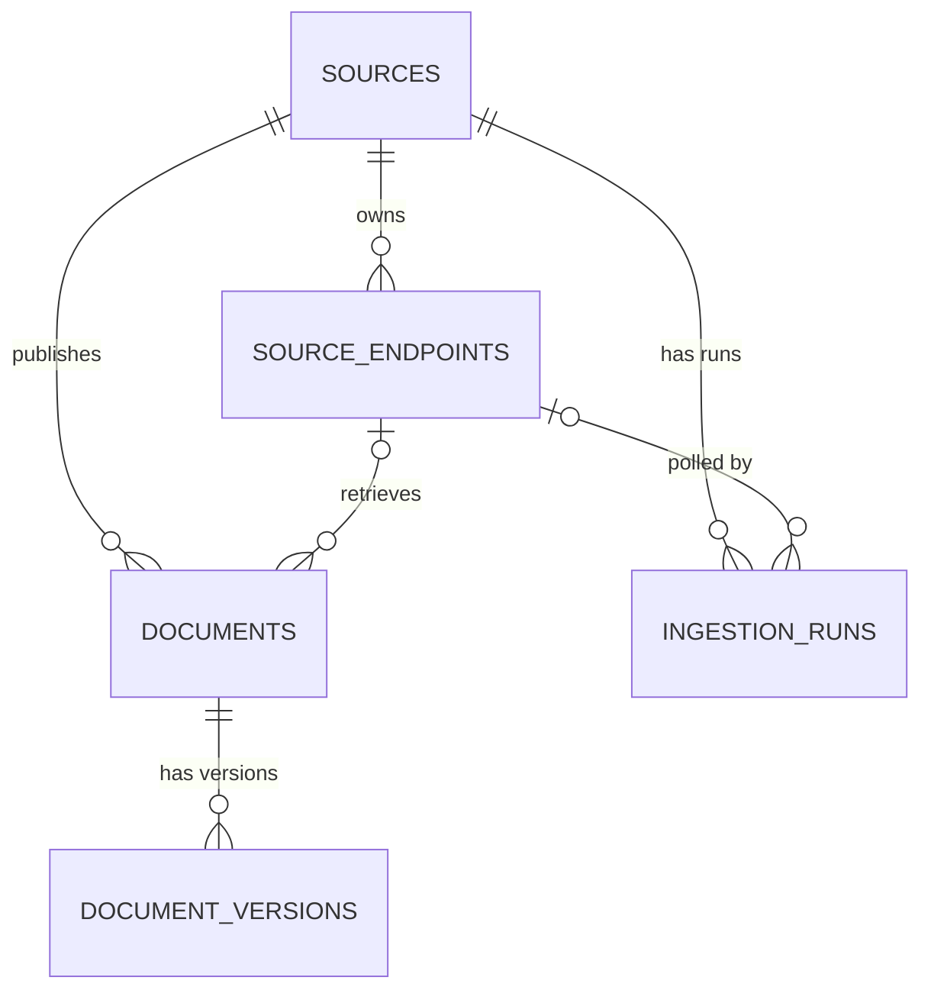

# Global News Intelligence Platform — Current Database Schema

**Document type:** Living implementation reference  
**Snapshot date:** 2026-07-24  
**Platform phase:** Phase 1 — Core Platform  
**Alembic revision:** `b9e26ebfcb4a`  
**PostgreSQL server version:** 17.10  
**Schema:** `public`  
**Authoritative snapshot:** `CURRENT_SCHEMA.sql`

---

## 1. Purpose

This document describes the database schema that is **actually implemented in PostgreSQL** at the snapshot identified above.

It is intentionally different from `DATABASE_SCHEMA_SPECIFICATION.md`:

- `DATABASE_SCHEMA.md` documents **what exists now**.
- `DATABASE_SCHEMA_SPECIFICATION.md` documents **the intended/future architecture**.
- `CURRENT_SCHEMA.sql` is the machine-readable PostgreSQL schema-only snapshot.
- Alembic migrations remain the authoritative incremental migration history.
- `SCHEMA_CHANGELOG.md` records major architectural schema milestones.

Future database design work should consult this document before adding or changing tables.

---

## 2. Current Schema Summary

The Phase 1 schema contains six tables:

| Table | Purpose |
|---|---|
| `alembic_version` | Records the current Alembic migration revision. |
| `sources` | Canonical publisher/source organizations. |
| `source_endpoints` | Pollable acquisition endpoints belonging to sources. |
| `documents` | Current normalized representation of ingested items. |
| `document_versions` | Immutable historical content snapshots for documents. |
| `ingestion_runs` | Durable operational history for ingestion attempts. |

Current Alembic revision:

```text
b9e26ebfcb4a
```

No custom PostgreSQL enum types, extensions, database functions, or triggers are present in this snapshot.

---

## 3. Entity Relationship Overview



Deletion behavior:

```text
sources
  └─ source_endpoints       ON DELETE CASCADE

sources
  └─ documents              ON DELETE RESTRICT

sources
  └─ ingestion_runs         ON DELETE RESTRICT

source_endpoints
  └─ documents              ON DELETE SET NULL

source_endpoints
  └─ ingestion_runs         ON DELETE SET NULL

documents
  └─ document_versions      ON DELETE CASCADE
```

This preserves document and ingestion history when an endpoint disappears while preventing deletion of a source that still owns historical documents or ingestion runs.

---

# 4. `alembic_version`

## Purpose

Stores the Alembic migration revision currently applied to the database.

## Columns

| Column | PostgreSQL type | Null | Default | Notes |
|---|---|---:|---|---|
| `version_num` | `varchar(32)` | No | — | Current Alembic revision identifier. |

## Constraints

- Primary key: `version_num`

Current value at this snapshot:

```text
b9e26ebfcb4a
```

---

# 5. `sources`

## Purpose

Represents canonical organizations, publishers, agencies, institutions, or other information sources.

A Source is distinct from a Source Endpoint. One source may own multiple endpoints.

## Columns

| Column | PostgreSQL type | Null | Default | Semantics |
|---|---|---:|---|---|
| `id` | `bigint` | No | sequence | Primary key. |
| `name` | `varchar(255)` | No | — | Canonical display name. |
| `native_name` | `varchar(255)` | Yes | — | Native-language source name when available. |
| `country` | `varchar(100)` | No | — | Home country/jurisdiction of the source organization. |
| `primary_language` | `varchar(20)` | No | — | Primary source language. |
| `source_type` | `varchar(50)` | No | — | Source organization/type classification used by the application. |
| `status` | `varchar(30)` | No | `'active'` | Lifecycle status. |
| `priority` | `varchar(20)` | No | `'normal'` | Polling/operational priority. |
| `website_url` | `text` | Yes | — | Canonical website URL where available. |
| `metadata` | `jsonb` | No | `{}` | Extensible source metadata. |
| `created_at` | `timestamptz` | No | `now()` | Creation timestamp. |
| `updated_at` | `timestamptz` | No | `now()` | Last application-managed update timestamp. |

## Important semantic invariant

`source.country` identifies the source organization's home country or jurisdiction.

It **must not** be treated as the authoritative geography of every document published by that source.

Future Phase 2 document geography classification belongs in canonical geography tables such as `geographies` and `document_geographies`.

## Constraints

- Primary key: `id`
- Unique: `website_url`

PostgreSQL permits multiple `NULL` values under this unique constraint.

## Indexes

```text
ix_sources_country            (country)
ix_sources_country_status     (country, status)
ix_sources_priority           (priority)
ix_sources_source_type        (source_type)
ix_sources_status             (status)
ix_sources_type_status        (source_type, status)
```

## Relationships

- One source may own many `source_endpoints`.
- One source may own many `documents`.
- One source may own many `ingestion_runs`.

Deletion behavior:

- deleting a source cascades to its endpoints;
- deletion is restricted while documents or ingestion runs reference the source.

## Application-level values

The database does not currently enforce PostgreSQL enums/check constraints for fields such as:

```text
status
priority
source_type
primary_language
country
```

Allowed values are therefore currently governed by application logic.

---

# 6. `source_endpoints`

## Purpose

Represents individual pollable acquisition endpoints belonging to a Source.

Examples include:

```text
RSS feed
Atom feed
future HTML listing endpoint
future API endpoint
future generated feed endpoint
```

A Source may have multiple Source Endpoints.

## Columns

| Column | PostgreSQL type | Null | Default | Semantics |
|---|---|---:|---|---|
| `id` | `bigint` | No | sequence | Primary key. |
| `source_id` | `bigint` | No | — | Parent Source. |
| `name` | `varchar(255)` | Yes | — | Endpoint-specific name. |
| `endpoint_type` | `varchar(30)` | No | `'rss'` | Acquisition endpoint type. |
| `url` | `text` | No | — | Pollable endpoint URL. |
| `status` | `varchar(30)` | No | `'active'` | Endpoint lifecycle status. |
| `poll_interval_seconds` | `integer` | No | `900` | Normal polling interval. |
| `last_checked_at` | `timestamptz` | Yes | — | Last verification/poll check. |
| `last_success_at` | `timestamptz` | Yes | — | Last successful endpoint operation. |
| `next_poll_at` | `timestamptz` | Yes | — | Scheduler's next eligible poll time. |
| `etag` | `varchar(512)` | Yes | — | HTTP ETag validator. |
| `last_modified` | `varchar(255)` | Yes | — | HTTP Last-Modified validator. |
| `last_http_status` | `integer` | Yes | — | Most recent HTTP response status tracked on endpoint. |
| `consecutive_failures` | `integer` | No | `0` | Consecutive failure counter. |
| `last_error` | `text` | Yes | — | Most recent endpoint error message. |
| `metadata` | `jsonb` | No | `{}` | Extensible endpoint metadata. |
| `created_at` | `timestamptz` | No | `now()` | Creation timestamp. |
| `updated_at` | `timestamptz` | No | `now()` | Last application-managed update timestamp. |

## Constraints

- Primary key: `id`
- Foreign key: `source_id → sources.id ON DELETE CASCADE`
- Unique: `url`
- Check: `poll_interval_seconds >= 60`

## Indexes

```text
ix_source_endpoints_due_poll       (status, next_poll_at)
ix_source_endpoints_endpoint_type  (endpoint_type)
ix_source_endpoints_source_id      (source_id)
ix_source_endpoints_source_status  (source_id, status)
ix_source_endpoints_status         (status)
```

## Operational notes

Phase 1 uses this table for native RSS/Atom lifecycle, scheduling, HTTP validators, endpoint health, and retry/backoff state.

Current application rules include:

- new endpoints begin disabled until verified;
- only active endpoints are eligible for normal scheduling;
- source status and endpoint status are separate;
- changing endpoint URL/type resets verification and health state;
- verification may activate a valid endpoint;
- endpoint health must not globally disable TLS verification.

The database itself does not currently constrain `status` or `endpoint_type` to enumerated values.

---

# 7. `documents`

## Purpose

Stores the current normalized representation of an ingested content item.

A document belongs permanently to a Source and may optionally retain its originating Source Endpoint.

## Columns

| Column | PostgreSQL type | Null | Default | Semantics |
|---|---|---:|---|---|
| `id` | `bigint` | No | sequence | Primary key. |
| `source_id` | `bigint` | No | — | Canonical publishing Source. |
| `source_endpoint_id` | `bigint` | Yes | — | Endpoint that acquired the item; may become `NULL` if endpoint is deleted. |
| `source_type` | `varchar(30)` | No | `'rss'` | Acquisition/source channel type in the Phase 1 model. |
| `external_id` | `varchar(2048)` | Yes | — | Feed/source-provided item identifier where available. |
| `canonical_url` | `text` | Yes | — | Canonical publisher URL for the document. |
| `title_original` | `text` | No | — | Original-language title. |
| `summary_original` | `text` | Yes | — | Original source summary/description when supplied. |
| `content_original` | `text` | Yes | — | Original source content when explicitly supplied/extracted. |
| `language` | `varchar(20)` | Yes | — | Document language when known. |
| `country` | `varchar(100)` | Yes | — | Phase 1 document country field. See warning below. |
| `author` | `varchar(512)` | Yes | — | Source-provided author/byline. |
| `published_at` | `timestamptz` | Yes | — | Original publication timestamp. |
| `source_updated_at` | `timestamptz` | Yes | — | Source-provided update timestamp. |
| `retrieved_at` | `timestamptz` | No | `now()` | Retrieval timestamp. |
| `content_hash` | `varchar(64)` | No | — | SHA-256 content hash. |
| `metadata` | `jsonb` | No | `{}` | Extensible document metadata. |
| `created_at` | `timestamptz` | No | `now()` | Database creation timestamp. |
| `updated_at` | `timestamptz` | No | `now()` | Last application-managed update timestamp. |

## Critical Phase 2 semantic warning

The existing:

```text
documents.country
```

is a Phase 1 field and **must not become the canonical document-geography architecture**.

For example:

```text
Source:
The Washington Post

Source country:
United States

Article concerns:
Japan
Philippines
China
```

Future Phase 2 classification must represent those document geographies independently through canonical geography relationships.

Likewise:

```text
documents.source_type
```

is **not** the future canonical `document_type`.

Acquisition/source channel and content/document type are separate dimensions.

## Constraints

- Primary key: `id`
- Foreign key: `source_id → sources.id ON DELETE RESTRICT`
- Foreign key: `source_endpoint_id → source_endpoints.id ON DELETE SET NULL`
- Unique: `(source_endpoint_id, external_id)`

The unique constraint allows multiple rows when either value is `NULL`, consistent with PostgreSQL's normal `NULL` semantics.

There is currently no uniqueness constraint on `canonical_url`.

## Indexes

```text
ix_documents_content_hash              (content_hash)
ix_documents_country                   (country)
ix_documents_endpoint_published_at     (source_endpoint_id, published_at)
ix_documents_language                  (language)
ix_documents_published_at              (published_at)
ix_documents_retrieved_at              (retrieved_at)
ix_documents_source_endpoint_id        (source_endpoint_id)
ix_documents_source_id                 (source_id)
ix_documents_source_published_at       (source_id, published_at)
ix_documents_source_type               (source_type)
ix_documents_source_type_published_at  (source_type, published_at)
```

## Phase 1 deduplication role

The current schema supports:

- endpoint/external-ID uniqueness;
- content-hash comparison;
- application-level canonical URL fallback logic.

---

# 8. `document_versions`

## Purpose

Stores historical snapshots when an existing document changes.

The table preserves earlier source content instead of silently overwriting history.

## Columns

| Column | PostgreSQL type | Null | Default | Semantics |
|---|---|---:|---|---|
| `id` | `bigint` | No | sequence | Primary key. |
| `document_id` | `bigint` | No | — | Parent document. |
| `version_number` | `integer` | No | — | Version sequence beginning at 1. |
| `canonical_url` | `text` | Yes | — | Canonical URL snapshot. |
| `title_original` | `text` | No | — | Title snapshot. |
| `summary_original` | `text` | Yes | — | Summary snapshot. |
| `content_original` | `text` | Yes | — | Content snapshot. |
| `language` | `varchar(20)` | Yes | — | Language snapshot. |
| `country` | `varchar(100)` | Yes | — | Phase 1 country snapshot. |
| `author` | `varchar(512)` | Yes | — | Author snapshot. |
| `published_at` | `timestamptz` | Yes | — | Publication timestamp snapshot. |
| `source_updated_at` | `timestamptz` | Yes | — | Source update timestamp snapshot. |
| `retrieved_at` | `timestamptz` | No | — | Retrieval timestamp represented by the version. |
| `content_hash` | `varchar(64)` | No | — | Content hash for this version. |
| `changed_fields` | `jsonb` | No | `[]` | Fields identified as changed. |
| `metadata` | `jsonb` | No | `{}` | Version metadata snapshot. |
| `created_at` | `timestamptz` | No | `now()` | Version record creation time. |

## Constraints

- Primary key: `id`
- Foreign key: `document_id → documents.id ON DELETE CASCADE`
- Unique: `(document_id, content_hash)`
- Unique: `(document_id, version_number)`
- Check: `version_number >= 1`

## Indexes

```text
ix_document_versions_content_hash         (content_hash)
ix_document_versions_document_created_at  (document_id, created_at)
ix_document_versions_document_id          (document_id)
```

## Design note

`document_versions` intentionally lacks an `updated_at` field because versions should behave as historical snapshots rather than mutable current-state rows.

Future Publisher Workspace evidence should be able to reference an exact `document_version_id` so research provenance survives later source edits.

---

# 9. `ingestion_runs`

## Purpose

Provides durable operational history for ingestion attempts.

This table is the authoritative historical record for ingestion execution rather than a Celery result backend.

## Columns

| Column | PostgreSQL type | Null | Default | Semantics |
|---|---|---:|---|---|
| `id` | `bigint` | No | sequence | Primary key. |
| `source_id` | `bigint` | No | — | Source associated with run. |
| `source_endpoint_id` | `bigint` | Yes | — | Endpoint associated with run, if it still exists. |
| `endpoint_url` | `text` | No | — | URL snapshot retained even if endpoint later changes/deletes. |
| `trigger_type` | `varchar(30)` | No | `'scheduled'` | Run trigger classification. |
| `status` | `varchar(30)` | No | `'running'` | Run lifecycle status. |
| `started_at` | `timestamptz` | No | `now()` | Start time. |
| `finished_at` | `timestamptz` | Yes | — | Finish time. |
| `duration_ms` | `bigint` | Yes | — | Duration in milliseconds. |
| `http_status` | `integer` | Yes | — | HTTP response status when applicable. |
| `response_bytes` | `bigint` | Yes | — | Response size when known. |
| `items_seen` | `integer` | No | `0` | Items encountered. |
| `items_created` | `integer` | No | `0` | New documents created. |
| `items_updated` | `integer` | No | `0` | Existing documents updated/versioned. |
| `items_unchanged` | `integer` | No | `0` | Items determined unchanged. |
| `items_failed` | `integer` | No | `0` | Item-level failures. |
| `error_type` | `varchar(255)` | Yes | — | High-level error classification. |
| `error_message` | `text` | Yes | — | Human-readable error. |
| `error_details` | `jsonb` | No | `{}` | Structured error data. |
| `metadata` | `jsonb` | No | `{}` | Extensible run metadata. |
| `created_at` | `timestamptz` | No | `now()` | Row creation timestamp. |
| `updated_at` | `timestamptz` | No | `now()` | Last application-managed update timestamp. |

## Constraints

- Primary key: `id`
- Foreign key: `source_id → sources.id ON DELETE RESTRICT`
- Foreign key: `source_endpoint_id → source_endpoints.id ON DELETE SET NULL`

Checks:

```text
duration_ms IS NULL OR duration_ms >= 0

finished_at IS NULL OR finished_at >= started_at

http_status IS NULL OR http_status BETWEEN 100 AND 599

items_seen >= 0
items_created >= 0
items_updated >= 0
items_unchanged >= 0
items_failed >= 0

response_bytes IS NULL OR response_bytes >= 0
```

## Indexes

```text
ix_ingestion_runs_endpoint_started_at  (source_endpoint_id, started_at)
ix_ingestion_runs_source_started_at    (source_id, started_at)
ix_ingestion_runs_status_started_at    (status, started_at)
```

## Operational design

The table is used for:

- run history;
- endpoint reliability calculations;
- ingestion failure analysis;
- operational dashboards;
- auditing what occurred during a fetch;
- preserving endpoint URL history independently of endpoint lifecycle.

---

# 10. Current Sequence Objects

The schema contains one PostgreSQL sequence for each bigint application-table primary key:

```text
sources_id_seq
source_endpoints_id_seq
documents_id_seq
document_versions_id_seq
ingestion_runs_id_seq
```

Each sequence is owned by the corresponding `id` column.

`alembic_version` does not use a sequence.

---

# 11. Current Index Inventory

## Sources

```text
ix_sources_country
ix_sources_country_status
ix_sources_priority
ix_sources_source_type
ix_sources_status
ix_sources_type_status
```

## Source Endpoints

```text
ix_source_endpoints_due_poll
ix_source_endpoints_endpoint_type
ix_source_endpoints_source_id
ix_source_endpoints_source_status
ix_source_endpoints_status
```

## Documents

```text
ix_documents_content_hash
ix_documents_country
ix_documents_endpoint_published_at
ix_documents_language
ix_documents_published_at
ix_documents_retrieved_at
ix_documents_source_endpoint_id
ix_documents_source_id
ix_documents_source_published_at
ix_documents_source_type
ix_documents_source_type_published_at
```

## Document Versions

```text
ix_document_versions_content_hash
ix_document_versions_document_created_at
ix_document_versions_document_id
```

## Ingestion Runs

```text
ix_ingestion_runs_endpoint_started_at
ix_ingestion_runs_source_started_at
ix_ingestion_runs_status_started_at
```

---

# 12. Phase 1 Architectural Invariants Reflected in the Schema

The implemented schema currently supports these important design rules:

### Sources and endpoints are separate

```text
Source
  └── one or more Source Endpoints
```

The source organization survives endpoint replacement and expansion.

### PostgreSQL is authoritative

Documents, source configuration, endpoint state, version history, and ingestion-run history are durable PostgreSQL records.

### Document originals are preserved

The current document model stores:

```text
title_original
summary_original
content_original
```

rather than overwriting source material with later AI output.

### Version history is normalized

Changed document content creates historical `document_versions` rather than silently losing prior snapshots.

### Endpoint lifecycle does not erase history

Endpoint references from `documents` and `ingestion_runs` use `ON DELETE SET NULL`, while source ownership remains retained.

### Ingestion runs remain durable

Operational ingestion outcomes live in PostgreSQL rather than depending on transient Celery result storage.

---

# 13. Known Phase 1 Fields That Must Not Define Phase 2 Architecture

Several Phase 1 columns are useful today but must not be overloaded as the system expands.

## `documents.country`

Do not treat this as the future canonical article geography.

Phase 2 will introduce multi-valued canonical geography relationships.

## `documents.source_type`

Do not treat this as canonical document type.

Examples of future independent document types include:

```text
news_report
press_release
court_decision
speech
legislation
regulation
research_paper
transcript
social_post
```

## JSONB `metadata`

Do not use JSONB as a substitute for normalized high-value relationships merely because it is convenient.

Canonical concepts such as topics, geographies, entities, document types, stories, calendar relationships, and Publisher Workspace provenance should receive relational models when their architecture calls for them.

---

# 14. Next Planned Schema Domain — Phase 2 Classification

The next major schema expansion is expected to introduce the Unified Document Classification foundation.

The planned Phase 2 topic seed must use **Canonical Topic Taxonomy v1.0**, whose frozen 23-root layer is:

```text
Politics
Law & Judiciary
War & Security
Foreign Affairs
Economy
Business
Technology
Energy
Health
Science
Environment
Society
Crime
Immigration
Media
Education
Religion
Arts, Culture & Entertainment
Disasters & Emergencies
Labor & Employment
Sports
Weather
Lifestyle & Human Interest
```

`CANONICAL_TOPIC_TAXONOMY.md` is authoritative for topic vocabulary and taxonomy-version governance. This root taxonomy is approved design intent only at the Phase 1 database snapshot; the `topics` table has not yet been implemented.

Expected Phase 2 schema concepts include:

```text
topics
geographies
entities
entity_aliases
document_types
classification_runs

document_topics
document_geographies
document_entities
document_type_assignments
```

This section records intent only.

These tables **do not exist in the current Phase 1 schema snapshot** and must not be represented elsewhere in this document as implemented until the corresponding Alembic migration is applied.

---

# 15. Schema Maintenance Procedure

After every schema-changing migration:

```text
Design change
    ↓
Consult DATABASE_SCHEMA.md
    ↓
Update SQLAlchemy models
    ↓
Create/review Alembic migration
    ↓
Run migration tests
    ↓
Apply migration
    ↓
Confirm `alembic current`
    ↓
Regenerate CURRENT_SCHEMA.sql
    ↓
Update DATABASE_SCHEMA.md
    ↓
Update SCHEMA_CHANGELOG.md
    ↓
Commit together
```

Recommended snapshot command:

```bash
pg_dump \
  --host=localhost \
  --username=news_intelligence_app \
  --dbname=news_intelligence \
  --schema-only \
  --no-owner \
  --no-privileges \
  --format=plain \
  > docs/database/CURRENT_SCHEMA.sql
```

The schema snapshot must never contain database passwords, application secrets, API keys, or production document data.

---

# 16. Source of Truth Hierarchy

When documentation disagrees, use this order:

```text
1. Applied PostgreSQL schema
2. Applied Alembic migrations
3. SQLAlchemy implementation
4. DATABASE_SCHEMA.md
5. Future-oriented technical specifications
```

A discrepancy between levels 1–3 is an implementation defect that should be investigated.

A discrepancy between the implemented schema and a future specification may simply indicate that the planned feature has not been implemented yet.

---

# 17. Snapshot Verification

This document was generated from the Phase 1 schema-only PostgreSQL dump supplied on 2026-07-24.

Observed database characteristics:

```text
PostgreSQL server: 17.10
pg_dump version:   17.10
Alembic revision:  b9e26ebfcb4a

Tables:            6
Application tables:5
Custom enums:      0
Extensions:        0
Functions:         0
Triggers:          0
```

Application tables:

```text
sources
source_endpoints
documents
document_versions
ingestion_runs
```

This snapshot is the baseline immediately preceding the Phase 2 classification schema expansion.
